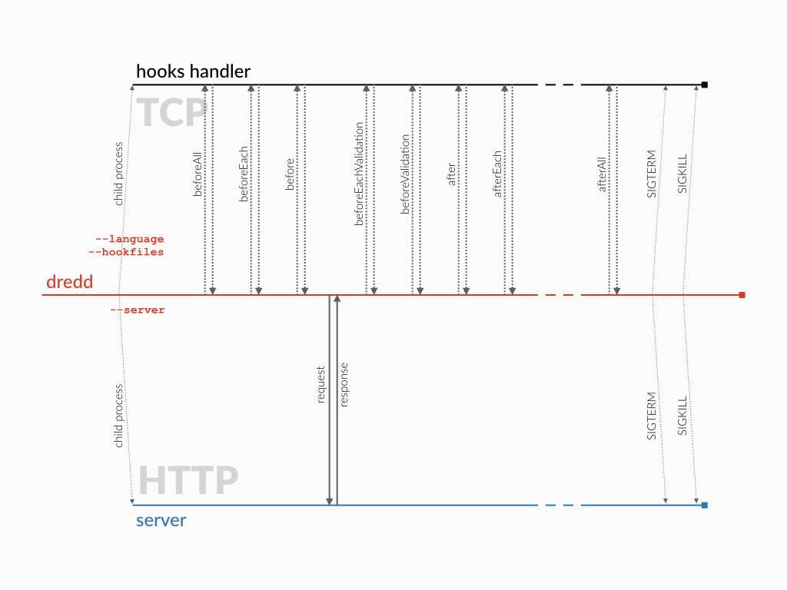

.. _hooks-new-language:

Writing a hooks handler for a new language
==========================================

Dredd itself is written in JavaScript, so having :ref:`hooks in JavaScript <hooks-nodejs>` is native to it. Other languages need so-called *hooks handlers*.

Several hooks handlers :ref:`already exist <supported-languages>`, either maintained by Dredd authors or external contributors. If you didn't find your favorite language among them, at this place you can learn how to create a new hooks handler.

.. note::
   `Deserve eternal praise <hall-of-fame>`__ and contribute hooks handler for **Java**! See :ghissue:`#875`

What is a hooks handler?
------------------------

Hooks handler is a process running separately from Dredd, usually started by Dredd as a child process when invoking Dredd with the :option:`--language` option. When Dredd performs testing, it communicates with the hooks handler over TCP socket. The hooks handler runs hooks for each HTTP transaction and lets Dredd know whether something got modified.

Hooks handler life cycle
------------------------

#. Dredd starts the command given in the :option:`--language` option as its child process (subprocess). Paths to files with hooks given in :option:`--hookfiles` are resolved to absolute paths and given to the child process as arguments.
#. The hooks handler reads paths to hooks from arguments and loads the hooks code.
#. The hooks handler opens a TCP socket on localhost, port 61321.
#. Dredd waits for a moment and then tries to connect to localhost, port 61321.
#. For each :ref:`type of hooks <types-of-hooks>` Dredd creates a message and sends it to the socket. The message contains UUID and serialized :ref:`transaction object <transaction>` (or an array of them, in case of `beforeAll`, `afterAll`). Individual messages are sent as JSON documents separated by a newline.
#. Hooks handler reads a message, calls a corresponding hook code, and sends back a message with modified contents.
#. Dredd awaits a message with corresponding UUID. Once it arrives, Dredd overwrites its internal HTTP transaction data with the ones from the incoming message.

Implementation guide
--------------------

A hooks handler is a CLI command, which implements following:

-  It accepts paths to hook files as arguments. They are already passed resolved as absolute paths, in the right order.
-  It allows users to register hook functions in the hook files, i.e. it provides a *hooks API* similar to those in other hooks handler implementations (see :ref:`JavaScript <hooks-nodejs>`, :ref:`Python <hooks-python>`, :ref:`Ruby <hooks-ruby>`). It allows to register :ref:`all types of hooks supported by Dredd <types-of-hooks>`.
-  It loads the hook files and registers any hook functions found in them for later execution.
-  It runs a TCP socket server on port 61321 and prints ``Starting`` to ``stdout`` when ready.

Handling hooks
^^^^^^^^^^^^^^

When any data is received by the TCP server, the hooks handler:

-  Adds every received character to a buffer.
-  When the delimiter ``LINE FEED (LF)`` character encoded as UTF-8 (``0A`` hex, ``\n`` in most languages) is received:

   -  Parses the :ref:`message <tcp-socket-message-format>` in the buffer as JSON.
   -  Finds the hook type in the ``event`` key of the received object and executes respective registered hook function(s). Beware, ``beforeEach`` and ``afterEach`` are overloaded - read the :ref:`tcp-socket-message-format` carefully.

-  When a hook function is being executed:

   -  Passes the value of the ``data`` key of the received object to the executed hook function.
   -  Allows the hook function to modify the data.

-  When a hook function is done:

   -  Takes the modified data and serializes it back to JSON with the same ``uuid`` as it has received
   -  Sends the JSON back as a TCP message
   -  Sends a ``LINE FEED (LF)`` character encoded as UTF-8 (``0A`` hex, ``\n`` in most languages) as TCP message delimiter

.. _tcp-socket-message-format:

TCP socket message format
^^^^^^^^^^^^^^^^^^^^^^^^^

-  transaction (object)

   -  uuid: ``234567-asdfghjkl`` (string) - ID used for unique identification of the message on both server and client sides
   -  event: ``event`` (enum) - :ref:`Hook type <types-of-hooks>`

      -  beforeAll (string) - Signals the hooks handler to run the ``beforeAll`` hooks
      -  beforeEach (string) - Signals the hooks handler to run the ``beforeEach`` and ``before`` hooks
      -  beforeEachValidation (string) - Signals the hooks handler to run the ``beforeEachValidation`` and ``beforeValidation`` hooks
      -  afterEach (string) - Signals the hooks handler to run the ``after`` and ``afterEach`` hooks
      -  afterAll (string) - Signals the hooks handler to run the ``afterAll`` hooks

   -  data (enum) - Data passed as an argument to the hook function

      -  (object) - Single :ref:`transaction object <transaction>`
      -  (array) - An array of :ref:`transaction objects <transaction>`, containing all transactions Dredd currently works with; sent for ``beforeAll`` and ``afterAll`` events

Termination
^^^^^^^^^^^

When there is an error or when the testing is done, Dredd signals the hooks handler process to terminate. This is done repeatedly with delays. When termination timeout is over, Dredd loses its patience and kills the process forcefully.

-  **retry delays** can be configured by :option:`--hooks-worker-term-retry`
-  **timeout** can be configured by :option:`--hooks-worker-term-timeout`

On Linux or macOS, Dredd uses the ``SIGTERM`` signal to tell the hooks handler process it should terminate. On Windows, where signals do not exist, Dredd sends the ``END OF TEXT`` character (``03`` hex, which is ASCII representation of Ctrl+C) to standard input of the process.

End-to-end test suite
---------------------

There is a `BDD <https://en.wikipedia.org/wiki/Behavior-driven_development>`__ test suite called `dredd-hooks-template <https://github.com/apiaryio/dredd-hooks-template>`__, which ensures that the public interface of each hooks handler works as Dredd expects. The test suite is written in `Gherkin <https://github.com/cucumber/cucumber/wiki/Gherkin>`__ and uses `Cucumber <https://github.com/cucumber/cucumber-js>`__ as a test runner.

.. image:: https://raw.githubusercontent.com/apiaryio/dredd-hooks-template/master/passing.png

When developing a new hooks handler, make sure it passes the test suite. Third party hooks handlers not passing the test suite cannot be endorsed by Dredd maintainers, integrated with Dredd's :option:`--language` option, or added to Dredd's documentation.

If you have any issues integrating the test suite to your project, reach out to the maintainers in `Dredd issues <https://github.com/apiaryio/dredd/issues>`__, we're happy to help!

Configuration options
---------------------

There are several configuration options, which can help you during development of the hooks handler:

-  :option:`--hooks-worker-timeout`
-  :option:`--hooks-worker-connect-timeout`
-  :option:`--hooks-worker-connect-retry`
-  :option:`--hooks-worker-after-connect-wait`
-  :option:`--hooks-worker-term-timeout`
-  :option:`--hooks-worker-term-retry`

.. warning::
   Behavior of the following options is currently broken (see :ghissue:`#917`) and it is recommended to stick to localhost and port 61321 until fixed:

   -  :option:`--hooks-worker-handler-host`
   -  :option:`--hooks-worker-handler-port`

.. note::
   The options mention *hooks worker* in their names, but it stands for the same as *hooks handler*. There is a proposal to rename the options in the future: :ghissue:`#1101`

Need help? No problem!
----------------------

If you have any questions, please:

-  Have a look at the reference `Python <https://github.com/apiaryio/dredd-hooks-python>`__ and `Ruby <https://github.com/apiaryio/dredd-hooks-ruby>`__ implementations.
-  If your language is compiled, check out how `Go <https://github.com/snikch/goodman>`__ and `Rust <https://github.com/hobofan/dredd-hooks-rust>`__ are done.
-  `File an issue <https://github.com/apiaryio/dredd/issues/new>`__ and get help from Dredd maintainers.
