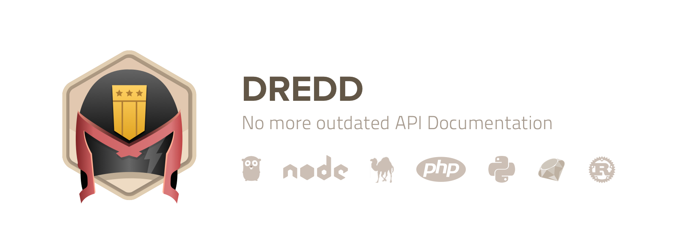

# Dredd — HTTP API Testing Framework

> **Dredd is a language-agnostic command-line tool for validating
API description document against backend implementation of the API.**

Dredd reads your API description and step by step validates whether your API
implementation replies with responses as they are described in the
documentation.

## Features

### Supported API Description Formats

- [API Blueprint][]
- [Swagger][]

### Supported Hooks Languages

Dredd supports writing [hooks](hooks.md) — a glue code for each test setup and teardown. Following languages are supported:

- [Go](hooks-go.md)
- [Node.js (JavaScript)](hooks-nodejs.md)
- [Perl](hooks-perl.md)
- [PHP](hooks-php.md)
- [Python](hooks-python.md)
- [Ruby](hooks-ruby.md)
- [Rust](hooks-rust.md)
- Didn't find your favorite language? _[Add a new one!](hooks-new-language.md)_

### Supported Systems

- Linux, macOS, Windows, ...
- [Travis CI][], [CircleCI][], [Jenkins][], [AppVeyor][], ...

## Contents

- [Installation](installation.md)
- [Quickstart](quickstart.md)
- [How It Works](how-it-works.md)
- [How-To Guides](how-to-guides.md)
- [Usage: CLI](usage-cli.md)
- [Usage: JavaScript](usage-js.md)
- [About Hooks](hooks.md)
- [Hooks: Go](hooks-go.md)
- [Hooks: JavaScript (Sandboxed)](hooks-js-sandbox.md)
- [Hooks: Node.js](hooks-nodejs.md)
- [Hooks: Perl](hooks-perl.md)
- [Hooks: PHP](hooks-php.md)
- [Hooks: Python](hooks-python.md)
- [Hooks: Ruby](hooks-ruby.md)
- [Hooks: Rust](hooks-rust.md)
- [Hooks: Other Languages](hooks-new-language.md)
- [Data Structures](data-structures.md)
- [Contributing](contributing.md)

## Useful Links

- [GitHub Repository][]
- [Bug Tracker][]
- [Changelog][]

## Example Applications

- [Express.js](https://github.com/apiaryio/dredd-example)
- [Ruby on Rails](https://gitlab.com/theodorton/dredd-test-rails/)

[API Blueprint]: https://apiblueprint.org/
[Swagger]: https://swagger.io/

[GitHub Repository]: https://github.com/apiaryio/dredd
[Bug Tracker]: https://github.com/apiaryio/dredd/issues?q=is%3Aopen
[Changelog]: https://github.com/apiaryio/dredd/releases

[Travis CI]: https://travis-ci.org/
[CircleCI]: https://circleci.com/
[Jenkins]: https://jenkins.io/
[AppVeyor]: https://www.appveyor.com/
